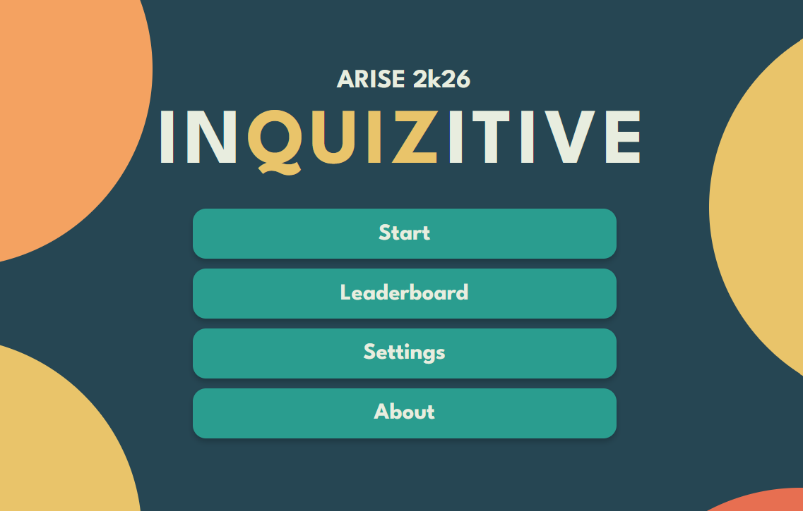

<p align="center">
  
</p>

<h1 align="center">🎯 inQUIZitive</h1>

<p align="center">
  <strong>An automated, modern, and interactive live event quiz platform built for quizmasters, hosts, schools, and corporate trivia events.</strong>
</p>

<p align="center">
  <a href="https://denzven.github.io/inQUIZitive/">
    
  </a>
  <a href="https://react.dev/">
    
  </a>
  <a href="https://www.typescriptlang.org/">
    
  </a>
  <a href="https://vitejs.dev/">
    
  </a>
  <a href="https://vite-pwa-org.netlify.app/">
    
  </a>
  <a href="LICENSE">
    
  </a>
</p>

---

## 🌟 What is inQUIZitive?

**inQUIZitive** is a feature-rich, web-based Progressive Web App (PWA) engineered specifically for conducting **live stage quizzes, trivia competitions, and classroom events**. Originally designed for high-stakes live projection presentations, inQUIZitive eliminates the need for expensive quiz hardware or complex server setups.

Whether you're running a fast-paced **Rapid Fire** round, an unpredictable **Spin Wheel** selection, a strategic **Tic-Tac-Toe** battle, or a **Buzzer** reaction test, inQUIZitive delivers a seamless, visually stunning experience right inside your web browser.

> 🚀 **100% Serverless & Offline Ready**: Load your questions via Excel (`.xlsx`), install the app on any laptop or tablet, and host your entire event completely offline without worrying about internet drops!

---

## ⚡ Key Highlights & Features

| Feature | Description |
| :--- | :--- |
| 🎮 **4 Interactive Round Modes** | Rapid Fire, Spin Wheel, Tic-Tac-Toe Grid, and Buzzer Mode. |
| 📊 **Excel Question Bank Import** | Upload `.xlsx` spreadsheets directly into the app with automatic structure audit. |
| ✏️ **In-App Question Editor** | Edit, add, or customize questions directly in browser with real-time JSON/XLSX export. |
| 🏆 **Live Scoreboard & Leaderboard** | Real-time score tracking, team color customization, podium animations, and point adjustments. |
| 📜 **Host Controls & Cheat Sheet** | Dedicated Host Helper Modal, password-protected admin access, and rule PDF exporter. |
| 🔊 **Audio & FX Engine** | Built-in sound effects for correct/wrong answers, countdown timers, spin wheels, and volume controls. |
| ⌨️ **Presenter Hotkeys** | Full keyboard control for smooth live projection without moving the mouse. |
| 📱 **Progressive Web App (PWA)** | Installable on desktop & mobile with complete offline functionality. |

---

## 🎲 Interactive Game Modes

<details open>
<summary><strong>1. ⚡ Rapid Fire Round</strong></summary>
<br>
A high-intensity, timer-based round designed for rapid question delivery. Features configurable countdown timers, instant correct/wrong scoring, answer reveal animations, and an emergency <strong>+5s time buffer shortcut</strong> for live event contingencies.
</details>

<details open>
<summary><strong>2. 🎡 Spin Wheel Round</strong></summary>
<br>
An engaging canvas-rendered spinning wheel that randomly selects question topics or team challenges. Includes realistic spin physics, wheel sound effects, and smooth reveal transitions.
</details>

<details open>
<summary><strong>3. ❌⭕ Tic-Tac-Toe Round</strong></summary>
<br>
A strategic 3x3 grid competition mode where teams claim tiles by answering questions correctly. Ideal for head-to-head team playoffs.
</details>

<details open>
<summary><strong>4. 🔔 Buzzer Mode</strong></summary>
<br>
A quick-response buzzer screen that records team buzz-ins in order, ensuring fair live play during speed-round trivia.
</details>

---

## 🚀 Host Guide & Technical Operating Manual

Conducting a live quiz event with **inQUIZitive** is effortless and fail-safe. Follow this comprehensive host operating guide for pre-event preparation and live stage execution:

### 1. Pre-Event Content Preparation & Audit Engine
- **Excel Spreadsheet & JSON Ingestion**: Prepare your questions offline using Microsoft Excel, Google Sheets, or JSON. Upload `.xlsx` files directly via **Settings** → **Question Bank Editor**.
- **Pre-Flight Audit Engine**: The built-in diagnostic engine automatically verifies your spreadsheet, flagging missing options, duplicate question strings across rounds, unassigned correct answer keys, invalid point weights, and default placeholder text (e.g. `Question 255`).
- **1-Click Auto-Fix & Inline Editing**: Use **Auto-Fix All** to instantly repair formatting errors, or click any flagged question to edit choices, correct answers, or categories live inside the app.

### 2. Single-Screen Broadcast & Stealth Presentation Mode
- **Single Shared Display Architecture**: Designed for live stage setups where the host laptop screen is cloned or directly projected to the audience display.
- **Stealth Mode (`H`)**: Press **`H`** or toggle Stealth Mode to fade top navigation bars, setup buttons, and admin indicators down to an 8% translucent opacity. Your screen instantly transforms into a pristine TV game show broadcast.
- **Hover Illumination & Fullscreen (`F`)**: Move your cursor to screen edges or top corners to temporarily illuminate administrative controls. Press **`F`** to launch full-screen presentation mode.

### 3. Mouse-Free Presenter Control & Emergency Protection
- **Hotkey Control**: Host the entire show using only your keyboard or wireless presenter remote:
  - **`1 - 4` / `A - D`**: Select multiple choice options A, B, C, or D.
  - **`Spacebar`**: Primary trigger key — reveals correct answers, advances steps, or starts timers.
  - **`Ctrl + Z` / `Cmd + Z`**: Global Undo Stack — instantly reverts accidental score edits or wrong answer clicks with visual toast confirmation.
  - **`+` / `=`**: Emergency +5s Rapid Fire time buffer injection during stage disruptions or team clarifications.
  - **`P` / `K`**: Pause / Resume active countdown timers.
  - **`M`**: Instant mute/unmute audio toggle.

### 4. Dynamic Scoreboard & Manual Score Overrides
- **Real-Time Standings Tallying**: Team scores update dynamically after every question and round with animated tallies.
- **Manual Score Override Modal**: Click any team's score card on the scoreboard to open the manual score override dialog. Add or deduct custom points with optional reason notes.
- **Automatic Stage Baseline Reset**: Points reset to zero between qualifying and stage rounds per competition guidelines, maintaining a level playing field while preserving tournament logs.
- **Sudden-Death Tiebreaker**: Launch the interactive 3x3 Tic-Tac-Toe grid duel directly from the standings screen whenever a round ends in a draw.

### 5. Dual-Screen Strategy & Master Answer Key Export
- **Printable Host Cheat Sheet**: Export a structured multi-page Host Cheat Sheet & Master Answer Key directly from the Question Bank Editor or Rules Screen.
- **Secondary Display Setup**: Print to paper or view as a PDF on a secondary smartphone, tablet, or clipboard to reference answer keys, trivia hints, and stage notes without revealing them on the audience screen.

### 6. 100% Offline PWA & Procedural Audio Engine
- **Network Independence**: Built as an offline-first Progressive Web App (PWA). Functions completely without internet or venue Wi-Fi.
- **Web Audio API Synthesizer**: All sound effects (timer ticks, correct chimes, wrong buzzers, drumrolls, applause, fanfare) and ambient background music are procedurally synthesized in real time via the Web Audio API without external MP3 dependencies.

---

## 📊 Excel Question Bank Format Guide

inQUIZitive allows hosts to prepare quiz questions offline using Microsoft Excel or Google Sheets. Simply format your `.xlsx` spreadsheet with the following standard columns:

| Column Name | Required | Description | Example |
| :--- | :---: | :--- | :--- |
| `Round` | Yes | Name of the round | `Rapid Fire` |
| `Question` | Yes | The question text | `What is the capital of France?` |
| `Option A` | Yes | First multiple choice option | `Berlin` |
| `Option B` | Yes | Second multiple choice option | `Madrid` |
| `Option C` | Yes | Third multiple choice option | `Paris` |
| `Option D` | Yes | Fourth multiple choice option | `Rome` |
| `Answer` | Yes | Correct option letter (`A`, `B`, `C`, or `D`) | `C` |
| `Points` | Optional | Score rewarded for correct answer | `10` |
| `Explanation`| Optional | Brief answer explanation/trivia note | `Paris has been the capital since 987 AD.` |

> 💡 **Sample Spreadsheet**: You can export a pre-formatted sample Excel file directly from the in-app **Question Bank Editor** under Settings!

---

## ⌨️ Presenter Keyboard Shortcuts

Control the entire quiz seamlessly during live stage projection using quick hotkeys:

| Key Shortcut | Action / Function |
| :--- | :--- |
| <kbd>1</kbd> <kbd>2</kbd> <kbd>3</kbd> <kbd>4</kbd> | Select Option A, B, C, or D |
| <kbd>Space</kbd> | Reveal Correct Answer |
| <kbd>←</kbd> <kbd>→</kbd> | Previous / Next Question (Auto-passes unanswered questions) |
| <kbd>Enter</kbd> | Start Round / Start Countdown Timer |
| <kbd>P</kbd> / <kbd>K</kbd> | Pause / Resume Countdown Timer |
| <kbd>F</kbd> | Toggle Fullscreen Projection Mode |
| <kbd>M</kbd> | Toggle Mute / Unmute Audio Sound FX |
| <kbd>H</kbd> | Toggle Stealth Presentation Mode |
| <kbd>Esc</kbd> | Return to Main Menu |
| <kbd>1</kbd> - <kbd>9</kbd> | Quick-award points to Team 1 through 9 |
| <kbd>+</kbd> | Emergency +5s Rapid Fire Timer Buffer |
| <kbd>Ctrl</kbd> + <kbd>Z</kbd> | Undo Last Score / Question Action |

---

## 💻 Tech Stack & Architecture

- **Frontend Core**: [React 19](https://react.dev/) + [TypeScript](https://www.typescriptlang.org/)
- **Build Tooling**: [Vite 8](https://vitejs.dev/)
- **State Management**: [Zustand 5](https://zustand-demo.pmnd.rs/) (with persistent local storage)
- **PWA & Offline Capability**: [vite-plugin-pwa](https://vite-pwa-org.netlify.app/)
- **Excel Ingestion & Parsing**: [SheetJS (xlsx)](https://docs.sheetjs.com/)
- **PDF Rules Export**: [html2canvas](https://html2canvas.hertzen.com/) + [jsPDF](https://github.com/parallax/jsPDF)
- **Icons**: [Lucide React](https://lucide.dev/)
- **Linter**: [Oxlint](https://github.com/oxc-project/oxc)

---

## 🛠️ Local Development & Setup

To clone and run inQUIZitive on your machine:

```bash
# 1. Clone the repository
git clone https://github.com/denzven/inQUIZitive.git

# 2. Navigate to the project folder
cd inQUIZitive_pwa

# 3. Install dependencies
npm install

# 4. Start the Vite development server
npm run dev
```

Open your browser and navigate to `http://localhost:5173`.

### Useful Commands

```bash
npm run build      # Compile TypeScript & create production build in /dist
npm run preview    # Preview production build locally
npm run lint       # Run Oxlint static analysis
npm run deploy     # Build and deploy app to GitHub Pages
```

---

## 🔍 SEO & Web Metadata

`inQUIZitive` is structured with comprehensive SEO microdata, JSON-LD OpenGraph schema, canonical links, and PWA manifest properties for high search engine indexing visibility:

- **Primary Keywords**: `inQUIZitive`, `live quiz app`, `trivia event software`, `pwa quizmaster tool`, `react 19 quiz`, `excel question bank parser`, `rapid fire quiz app`, `spin wheel quiz`
- **Application Category**: `GameApplication / Educational tool`
- **OpenGraph Image**: `banner.png`

---

## 📄 License & Attribution

Distributed under the **MIT License**. See `LICENSE` for more information.

<p align="center">
  Crafted with ❤️ by <strong><a href="https://github.com/denzven">Denzven</a></strong>
</p>
